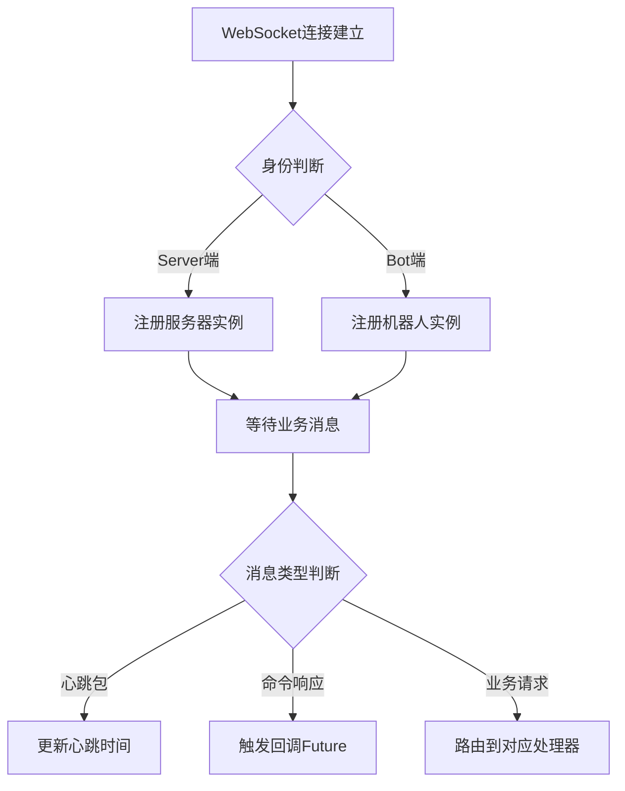

# HuHoBot WebSocket 服务端

轻量级 Minecraft 服务器通信中台，实现 WebSocket 协议的双向通信桥梁。

## 核心能力

### 架构特性

- **双端连接管理**：同时处理 Bot客户端 和 服务器端 的 WebSocket 连接
- **事件驱动模型**：内置 9 种核心事件处理器
- **异步响应机制**：基于 CompletableFuture 的异步回调系统
- **会话生命周期管理**：自动清理失效连接

### 协议特征

- **心跳维持**：`heart` 事件保持长连接
- **消息分拣**：通过 header.type 自动路由消息
- **唯一标识**：通过 packId 实现请求-响应匹配

## 核心事件处理

| 事件类型                  | 处理器类                     | 功能描述        |
|-----------------------|--------------------------|-------------|
| heart                 | handleHeart              | 心跳包维持连接     |
| success/error         | handleResponeMsg         | 通用响应处理      |
| queryWl               | handleResponeWhiteList   | 白名单查询响应     |
| queryOnline           | handleResponeOnlineList  | 在线玩家查询响应    |
| bindConfirm           | handleBindConfirm        | 服务器绑定确认处理   |
| SEND_MSG_BY_SERVER_ID | handleBotSendPack2Server | 机器人消息转发到服务器 |
| QUERY_CLIENT_LIST     | handleBotQueryClientList | 客户端列表查询     |
| shakeHand             | handleShakeHand          | 握手协议处理      |

## 消息处理流程

## 配置说明

### 环境要求

- JDK 17+
- Spring Boot 3.x
- Fastjson2 2.0+

